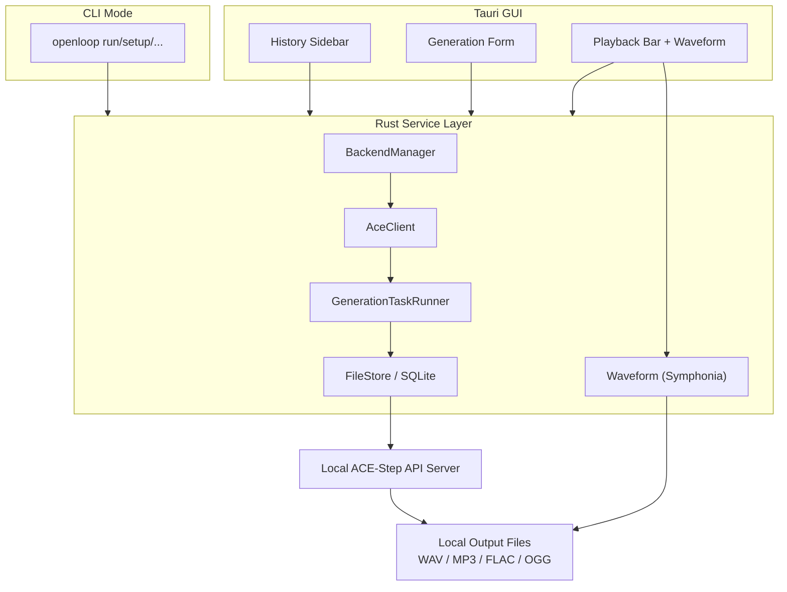

[简体中文](./README_CN.md)

<div align="center">


# OpenLoop

**Generate music locally on your Mac.**

An open-source desktop AI music generator powered by local inference, built for the OpenMusic series.

[](https://github.com/thedavidweng/OpenLoop/actions/workflows/ci.yml)
[](https://github.com/thedavidweng/OpenLoop/releases)
[](./LICENSE)


</div>

---

## OpenMusic Series

| Project                                              | Purpose                                                                                  | Status       |
| ---------------------------------------------------- | ---------------------------------------------------------------------------------------- | ------------ |
| [OpenKara](https://github.com/thedavidweng/OpenKara) | Turn local songs into karaoke tracks with on-device AI stem separation and synced lyrics | Active       |
| OpenLoop                                             | Generate new music locally from prompts, lyrics, and musical parameters                  | Alpha v0.2.0 |

The shared philosophy is simple: music tools should be local-first, ownership-friendly, transparent, and useful with the media and hardware you already have.

---

## Why I Built This

AI music tools are powerful, but many of them share the same problems:

1. They require subscriptions.
2. They send prompts, lyrics, and creative drafts to cloud services.
3. They hide model behavior behind closed platforms.
4. They make export, ownership, and reproducibility harder than they should be.

---

## Installation

```bash
brew tap thedavidweng/tap && brew install --cask openloop
```

Homebrew automatically adds `openloop` to your PATH and clears macOS quarantine.

### Install from DMG (manual)

1. Download the latest `.dmg` from [Releases](https://github.com/thedavidweng/OpenLoop/releases).
2. Drag **OpenLoop** to **Applications**.
3. **First launch:** macOS may show a Gatekeeper warning because the app uses Ad-hoc code signing. Right-click the app and choose **Open**, or run in Terminal:
   ```bash
   xattr -cr /Applications/OpenLoop.app
   ```
4. Open Settings → "Add to PATH" to enable the CLI.

---

## CLI Mode

`openloop` ships with a full CLI in the same binary as the desktop app. Pass any subcommand and it runs headlessly — no GUI needed.

```bash
openloop run "lo-fi warm piano, 90 BPM"
openloop run --model pro --duration 30 --output ~/Music/beat.mp3
openloop setup model turbo
openloop list --json
openloop ps
```

Every GUI operation maps to a CLI command. The CLI reads/writes the same SQLite database, so history and settings stay in sync with the app.

### Agent Pipelines

Paired with **[Remotion](https://github.com/remotion-dev/remotion)** (programmatic React video rendering) or **[HyperFrames](https://github.com/heygen-com/hyperframes)** (HTML-to-video), an AI coding agent can orchestrate end-to-end video workflows:

```
AI agent → openloop run (music) → Remotion / HyperFrames (video) → final render
```

The `--json` flag streams machine-readable NDJSON — agents parse one JSON line at a time:

```bash
openloop run "cinematic strings" --json | while read line; do
  echo "Progress: $(echo "$line" | jq -r '.event')"
done
```

[Full CLI documentation →](./docs/cli.md)

---

## Features

### v0.2 Alpha

- **Text-to-Music Generation** — Generate music from prompts such as `lo-fi warm piano, 90 BPM, no vocal`.
- **Lyrics Input** — Add lyrics with optional structure tags like `[verse]`, `[chorus]`, and `[bridge]`.
- **Local AI Backend** — Run ACE-Step locally through a managed backend process.
- **Apple Silicon Acceleration** — Use MLX on Apple Silicon with CPU/GPU execution and unified memory.
- **Duration Control** — Generate clips from short loops to longer song drafts.
- **BPM, Key, and Time Signature Controls** — Provide musical constraints for generation.
- **Seed Reproduction** — Reuse a seed to reproduce or iterate on previous results.
- **Built-in Preview Player** — Play generated audio inside the app.
- **Waveform Review** — Inspect generated audio with a waveform surface rendered from Rust audio decoding.
- **Local Generation History** — Store prompt, lyrics, model settings, seed, and output path in a local SQLite database.
- **Export** — Save generated audio to a local output folder.

### Planned after v0.1

- Repaint / local audio region regeneration
- Multi-model profile management
- More robust model downloader
- macOS signing and notarization
- Advanced export and audio conversion options

---

## Build from Source

### Prerequisites

- macOS 14+ recommended
- Apple Silicon Mac recommended
- Node.js 20+
- pnpm 11+
- Rust stable toolchain
- Tauri 2 platform dependencies

### Clone and run

```bash
git clone https://github.com/thedavidweng/OpenLoop.git
cd OpenLoop
pnpm install
pnpm tauri dev
```

### Development checks

```bash
pnpm install
pnpm release:check
```

### Local release build

```bash
pnpm install --frozen-lockfile
pnpm release:build
```

Detailed manual QA notes live in [`docs/testing.md`](docs/testing.md).
Release packaging notes live in [`docs/release.md`](docs/release.md).

For the current implementation status and more development details, see [Implementation Status](./docs/implementation-status.md).

## System Requirements

| Requirement      | v0.1 Target                                                                                 |
| ---------------- | ------------------------------------------------------------------------------------------- |
| Operating system | macOS 14+ recommended; macOS 12–13 best effort                                              |
| CPU/GPU          | Apple Silicon recommended                                                                   |
| Memory           | 8 GB minimum target; 16 GB+ recommended                                                     |
| Storage          | Several GB for models and generated audio                                                   |
| Network          | Required for first model/backend setup; offline afterward unless the user chooses otherwise |

Intel Mac support is experimental and outside the v0.1 acceptance target.

---

## AI Models

OpenLoop uses [ACE-Step 1.5](https://github.com/ace-step/ACE-Step-1.5) as the local music generation backend.

The app targets a profile-based model setup:

| Profile | Target Device        | Default Strategy                             |
| ------- | -------------------- | -------------------------------------------- |
| Lite    | 8 GB Apple Silicon   | Conservative settings, lower memory pressure |
| Turbo   | 16 GB+ Apple Silicon | Recommended default for v0.1                 |
| Pro     | 24 GB+ Apple Silicon | Highest quality with XL model and larger LM  |

Model files are downloaded or selected during first setup and stored locally. The application code is MIT licensed; model weights and third-party components follow their upstream licenses.

---

## Tech Stack

| Layer                   | Technology                                               | Purpose                                                                                 |
| ----------------------- | -------------------------------------------------------- | --------------------------------------------------------------------------------------- |
| Desktop framework       | [Tauri 2](https://v2.tauri.app/)                         | Rust backend + system WebView desktop shell                                             |
| Frontend                | React + TypeScript + Vite                                | App UI, generation form, player, history panel                                          |
| Backend orchestration   | Rust                                                     | Process management, API proxy, file operations, SQLite                                  |
| AI backend              | [ACE-Step 1.5](https://github.com/ace-step/ACE-Step-1.5) | Local music generation                                                                  |
| Apple Silicon inference | [MLX](https://github.com/ml-explore/mlx)                 | Apple Silicon CPU/GPU execution and unified memory                                      |
| Python environment      | bundled `uv` sidecar                                     | Reproducible local backend environment without relying on user-installed Python or `uv` |
| Database                | SQLite                                                   | Settings, generation history, backend events                                            |
| Packaging               | Tauri bundler                                            | macOS `.dmg` release                                                                    |

---

## Architecture



OpenLoop uses a local API server model — the Rust service layer owns process lifecycle, health checks, task polling, file paths, and error mapping. The same service layer is shared by both GUI and CLI modes.

---

## Data and Privacy

OpenLoop is local-first by design.

- Prompts stay on your Mac.
- Lyrics stay on your Mac.
- Generated audio stays on your Mac.
- History is stored in a local SQLite database.
- No account system is planned for v0.1.
- No telemetry is planned for v0.1.
- The app should only use the network for model/backend setup or user-initiated external links.

Logs should avoid storing full lyrics or complete sensitive prompts. Backend errors should be summarized into user-readable messages.

---

## Responsible Use

OpenLoop does not provide legal clearance for generated music.

Users are responsible for checking whether generated output is appropriate for publication, monetization, or commercial use. Avoid entering protected lyrics, melodies, voices, or prompts that explicitly imitate protected artists or copyrighted works. When publishing generated music, follow applicable laws and platform rules around AI-generated content disclosure.

---

## Known Limitations

- v0.1 targets Apple Silicon first.
- Intel Mac support is experimental.
- First setup may require a large model download.
- Generation speed depends heavily on memory, model profile, duration, and inference settings.
- Repaint is planned after the first Alpha.
- The app does not guarantee copyright-free output.
- The current UI favors local workflow coverage and technical completeness over final visual polish.

---

## Contributing

Contributions are welcome once the initial Alpha structure is in place.

Recommended contribution areas:

- macOS packaging
- Tauri backend process management
- ACE-Step API integration
- generation history UX
- model setup diagnostics
- low-memory performance testing
- documentation

Before opening a large PR, please open an issue describing the proposed change.

---

## License

OpenLoop application code is released under the [MIT License](LICENSE).

Third-party models, libraries, and tools retain their own licenses. In particular, ACE-Step, MLX, FFmpeg, Tauri, and other dependencies should be reviewed according to their upstream license terms before redistribution.

---

## Acknowledgements

OpenLoop builds on work from the open-source music and local AI ecosystem, including:

- [ACE-Step 1.5](https://github.com/ace-step/ACE-Step-1.5)
- [MLX](https://github.com/ml-explore/mlx)
- [Tauri](https://v2.tauri.app/)
- The broader open-source audio tooling community

OpenLoop is part of the OpenMusic series by [David Weng](https://github.com/thedavidweng).

## Roadmap

For the detailed development roadmap and planning documents, see:

- **[Implementation Status](./docs/implementation-status.md)** — Current implementation status and completed milestones
- **[Testing Guide](./docs/testing.md)** — QA procedures and manual test coverage notes

---
