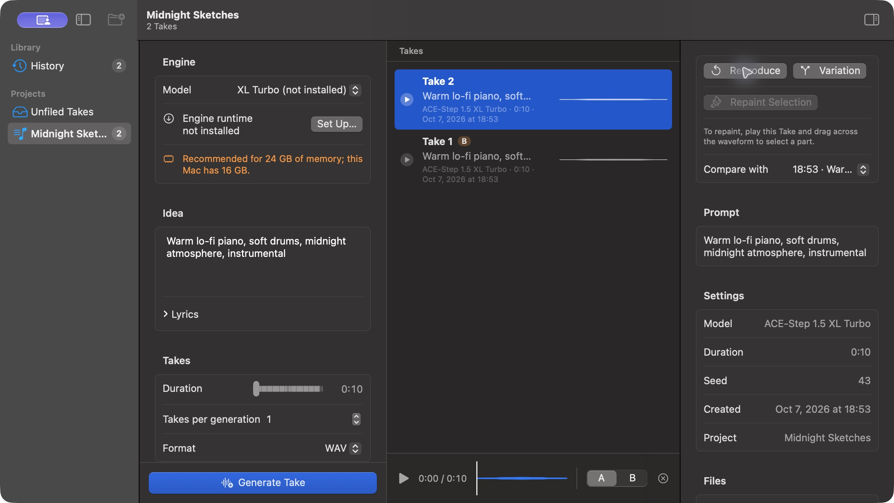
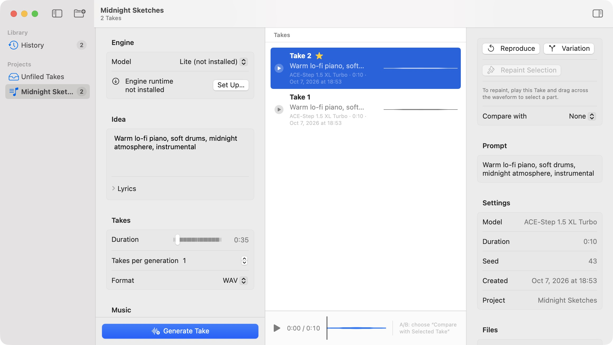
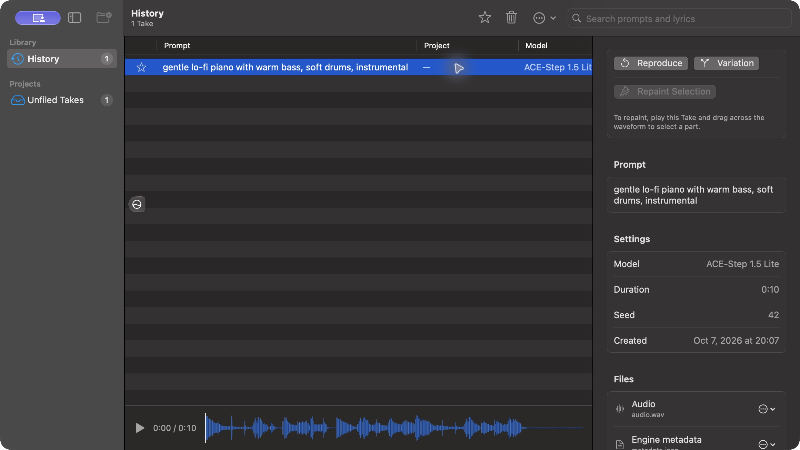
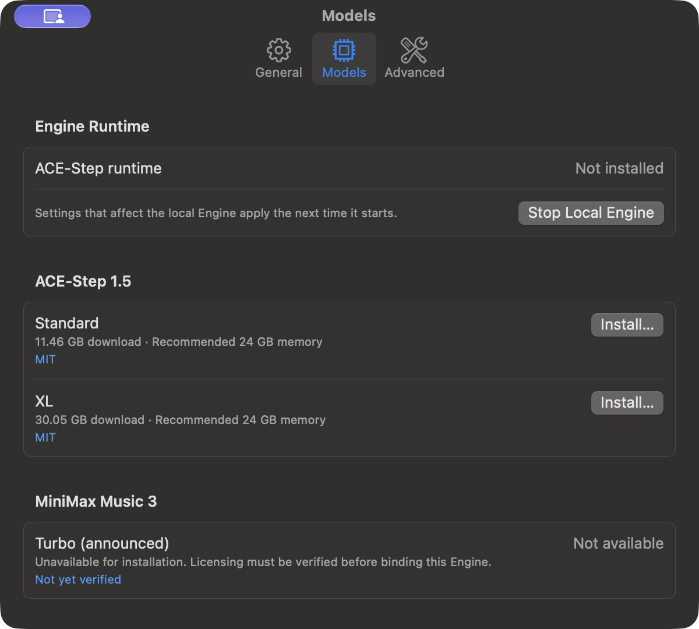
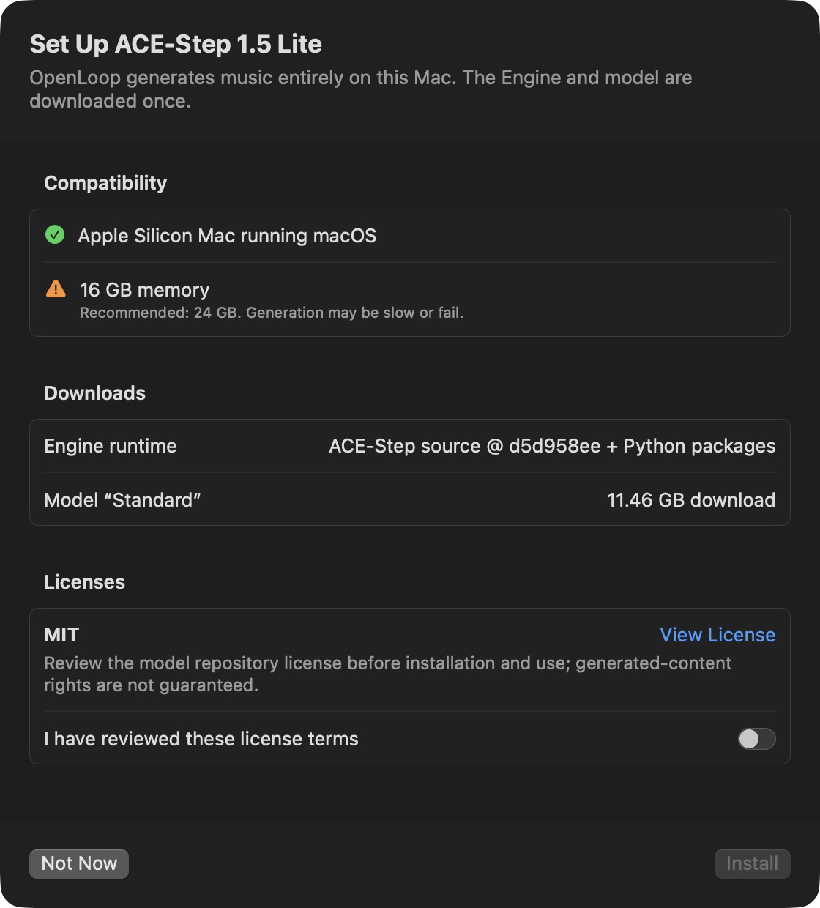

[简体中文](./README_CN.md)

> Native macOS Alpha: SwiftUI app, separate Swift CLI, and shared Swift core. Requires Apple Silicon and macOS 15+.

<div align="center">


# OpenLoop

**Generate music locally on your Mac.**

An open-source desktop AI music generator powered by local inference, built for the OpenMusic series.

[](https://github.com/thedavidweng/OpenLoop/actions/workflows/ci.yml)
[](https://github.com/thedavidweng/OpenLoop/releases)
[](./LICENSE)


</div>

---

## Native workspace

**v0.2.1 Alpha**

Organize music into Projects, generate Takes from prompts and lyrics, compare A/B,
reproduce a seed or create variations, select a waveform region for loop playback
or Repaint, and export Artifacts. History supports search and favorites across
Projects. Settings installs the pinned ACE-Step runtime and Model Packs locally.
MiniMax Music 3 is announced but unavailable. The UI is currently English-only.
The current pinned backend can exceed 16 GB memory even in Lite; limited-memory
Macs may swap heavily. See the measured acceptance results before installing.

These are actual packaged-app screenshots from an isolated test library. Workspace Takes use synthetic WAV test audio. The History capture shows a real
10-second Lite generation with seed 42; screenshots do not assess listening quality. See [acceptance results](docs/testing.md#native-macos-acceptance--2026-10-07).

**Compose, Takes, and inspector — dark appearance**



<details>
<summary>Light appearance, History, model catalog, and first-time setup</summary>









</details>

## Installation

The native release workflow builds an Apple Silicon DMG and creates a draft release.
Download the **native** DMG when published in [Releases](https://github.com/thedavidweng/OpenLoop/releases),
then drag OpenLoop to Applications. Older release assets and the Homebrew cask may
still install the retiring Tauri app; verify the asset before upgrading.

This Alpha is ad-hoc signed, not Developer ID signed or notarized. If Gatekeeper
blocks your downloaded copy, use the release instructions in [docs/release.md](docs/release.md).
The native app has no built-in updater.

Before upgrading, stop the legacy app and back up its library. Native imports
legacy state once without moving original audio. Native GUI and CLI share their
library; changes do not synchronize back to the retiring app. Use
`OPENLOOP_DATA_DIR=/tmp/openloop-native-test` to isolate GUI evaluation, and
`--data-dir /tmp/openloop-native-test` for CLI evaluation.

## CLI

The headless executable is separate from the GUI:

```sh
CLI=/Applications/OpenLoop.app/Contents/MacOS/openloop-cli
"$CLI" catalog --json
"$CLI" setup --accept-license
"$CLI" models install ace-step/standard --accept-license
"$CLI" run --configuration ace-step/lite --prompt 'gentle piano' --duration 10 --json
"$CLI" list --json
```

Read the catalog licenses before accepting them. Setup downloads a Python runtime
and dependencies; Model Packs download several GB. Generation runs locally.
Native `--json` emits **NDJSON v2**; legacy v1 scripts must migrate.
[CLI guide](docs/cli.md) · [v2 contract](docs/specs/native-cli.md).

## Build from source

Requires Apple Silicon, macOS 15+, Swift 6.2+ and Node.js 24+ for sidecar preparation.

```sh
swift build --package-path native -Xswiftc -warnings-as-errors
swift test --package-path native -Xswiftc -warnings-as-errors
node scripts/prepare-sidecars.mjs
python3 native/scripts/package-app.py --uv src-tauri/binaries/uv-aarch64-apple-darwin
python3 native/scripts/smoke-cli.py
```

[Native architecture and development](native/README.md) · [Release packaging](docs/release.md).
React/Tauri/Rust remain migration references, not the native release target.

## OpenMusic Series

[OpenKara](https://github.com/thedavidweng/OpenKara) turns local songs into karaoke
with on-device stem separation and synced lyrics. OpenLoop generates new music
locally. Both favor local processing and user ownership.

## Contributing

Open an issue before a large change. See [GitHub issues](https://github.com/thedavidweng/OpenLoop/issues)
for the roadmap and [testing.md](docs/testing.md) for acceptance coverage.

## License

OpenLoop application code uses the [Apache License 2.0](LICENSE).
Third-party runtimes, models and tools retain their own license terms. Generated
content is not guaranteed copyright-free; review the model and content terms
before distribution.

## Acknowledgements

Built on [ACE-Step 1.5](https://github.com/ace-step/ACE-Step-1.5),
[MLX](https://github.com/ml-explore/mlx), and open-source audio tooling.
Part of the OpenMusic series by [David Weng](https://github.com/thedavidweng).
