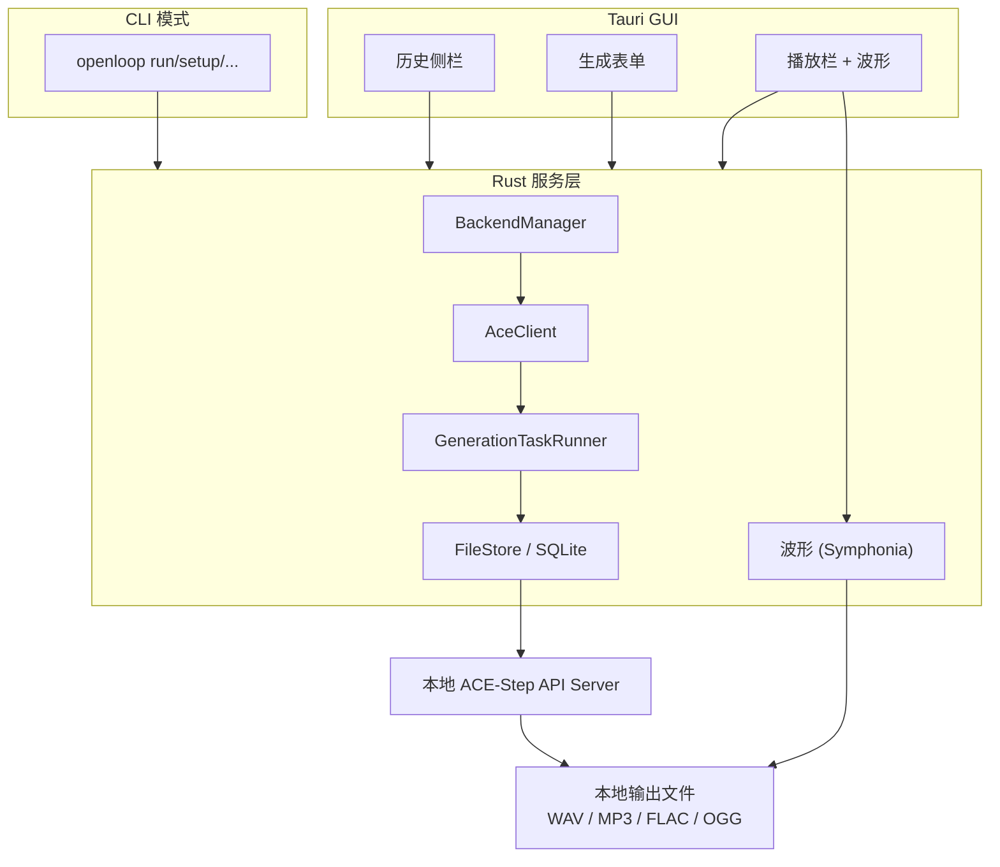

[English](./README.md)

<div align="center">


# OpenLoop

**在本地 Mac 上生成音乐。**

一个基于本地推理的开源桌面 AI 音乐生成器，属于 OpenMusic 系列。

[](https://github.com/thedavidweng/OpenLoop/actions/workflows/ci.yml)
[](./LICENSE)


</div>

---

## OpenMusic 系列

| 项目                                                 | 用途                                                          | 状态         |
| ---------------------------------------------------- | ------------------------------------------------------------- | ------------ |
| [OpenKara](https://github.com/thedavidweng/OpenKara) | 用本地 AI 进行人声分离，并配合同步歌词，把本地歌曲变成卡拉 OK | Active       |
| OpenLoop                                             | 根据提示词、歌词和音乐参数，在本地生成新音乐                  | Alpha v0.1.0 |

这个系列的共同理念很简单：音乐工具应该本地优先、尊重所有权、透明，并且能够直接利用你手头已有的媒体和硬件。

---

## 为什么做这个项目

AI 音乐工具很强，但它们常见的问题也很一致：

1. 需要订阅。
2. 会把提示词、歌词和草稿发到云端。
3. 把模型行为封装在封闭平台里。
4. 导出、所有权和可复现性都不够直接。

---

## 安装

```bash
brew tap thedavidweng/tap && brew install --cask openloop
```

Homebrew 自动将 `openloop` 添加到 PATH 并清除 macOS 隔离标记。直接 DMG 下载可在 [Releases](https://github.com/thedavidweng/OpenLoop/releases) 获取 — 安装后打开设置 → "添加到 PATH" 即可启用 CLI。

---

## CLI 模式

`openloop` 二进制内置完整 CLI，与桌面应用共享同一服务层。传入任何子命令即运行无头模式。

```bash
openloop run "lo-fi warm piano, 90 BPM"
openloop run --model pro --duration 30 --output ~/Music/beat.mp3
openloop setup model turbo
openloop list --json
openloop ps
```

CLI 读写相同的 SQLite 数据库，历史记录和设置与应用同步。

### 代理流水线

搭配 **[Remotion](https://github.com/remotion-dev/remotion)** 和 **[HyperFrames](https://github.com/heygen-com/hyperframes)**，AI 编码代理可编排端到端视频工作流：

```bash
openloop run "cinematic strings" --json | while read line; do
  echo "进度: $(echo "$line" | jq -r '.event')"
done
```

[完整 CLI 文档 →](./docs/cli.md)

---

## 功能

### v0.1.0 Alpha

- **文本生成音乐** - 例如 `lo-fi warm piano, 90 BPM, no vocal`
- **歌词输入** - 支持 `[verse]`、`[chorus]`、`[bridge]` 这类结构标签
- **本地 AI 后端** - 通过受管进程在本地运行 ACE-Step
- **Apple Silicon 加速** - 在 Apple Silicon 上使用 MLX，并支持 CPU/GPU 和统一内存
- **时长控制** - 支持从短循环到更长的草稿片段
- **BPM / 调性 / 拍号控制** - 为生成结果提供音乐约束
- **Seed 可复现** - 复用 seed 复现或迭代之前的结果
- **内置预览播放器** - 播放/暂停、拖动、跳过、变速
- **波形显示** - Rust Symphonia 音频解码生成波形
- **本地生成历史** - 搜索、加载、删除历史记录
- **导出** - Reveal in Finder、导出复制
- **CLI** - 10 个子命令，NDJSON 流式输出
- **i18n** - 英文、简体中文
- **键盘快捷键** - Space、Cmd+B、Cmd+N、Cmd+,、Cmd+Enter

### v0.1.0 之后计划

- 局部重绘 / 本地音频区域重生成
- 多模型配置管理
- 更稳健的模型下载器
- macOS 签名与公证
- 更高级的导出和音频转换选项

---

## 从源码构建

### 先决条件

- macOS 14+ 推荐
- 推荐 Apple Silicon Mac
- Node.js 20+
- pnpm 10+
- Rust stable toolchain
- Tauri 2 平台依赖

### 克隆并运行

```bash
git clone https://github.com/thedavidweng/OpenLoop.git
cd OpenLoop
pnpm install
pnpm tauri dev
```

### 开发检查

```bash
pnpm install
pnpm release:check
```

详细的人工 QA 记录见 [`docs/testing.md`](docs/testing.md)。

当前实现状态和更多开发细节见 [Implementation Status](./docs/implementation-status.md)。

## 系统需求

| 需求     | v0.1 目标                                               |
| -------- | ------------------------------------------------------- |
| 操作系统 | 推荐 macOS 14+；macOS 12 - 13 为尽力支持                |
| CPU/GPU  | 推荐 Apple Silicon                                      |
| 内存     | 最低 8 GB；推荐 16 GB+                                  |
| 存储     | 模型和生成音频需要数 GB 空间                            |
| 网络     | 首次模型 / 后端初始化需要；之后可离线，除非用户另行选择 |

Intel Mac 支持是实验性的，不在 v0.1 的验收目标内。

---

## AI 模型

OpenLoop 使用 [ACE-Step 1.5](https://github.com/ace-step/ACE-Step-1.5) 作为本地音乐生成后端。

项目采用按配置文件划分的模型方案：

| 配置  | 目标设备             | 默认策略                    |
| ----- | -------------------- | --------------------------- |
| Lite  | 8 GB Apple Silicon   | 更保守的设置，更低内存压力  |
| Turbo | 16 GB+ Apple Silicon | v0.1 推荐默认               |
| Pro   | 24 GB+ Apple Silicon | 最高质量，XL 模型 + 更大 LM |

模型文件会在首次启动时下载或选择，并保存在本地。应用代码采用 MIT 许可；模型权重和第三方组件遵循各自上游许可。

---

## 技术栈

| 层                 | 技术                                                     | 作用                                                    |
| ------------------ | -------------------------------------------------------- | ------------------------------------------------------- |
| 桌面框架           | [Tauri 2](https://v2.tauri.app/)                         | Rust 后端 + 系统 WebView 桌面壳                         |
| 前端               | React + TypeScript + Vite                                | 应用 UI、生成表单、播放器、历史面板                     |
| 后端编排           | Rust                                                     | 进程管理、API 代理、文件操作、SQLite                    |
| AI 后端            | [ACE-Step 1.5](https://github.com/ace-step/ACE-Step-1.5) | 本地音乐生成                                            |
| Apple Silicon 推理 | [MLX](https://github.com/ml-explore/mlx)                 | Apple Silicon CPU/GPU 执行和统一内存                    |
| Python 环境        | 内置 `uv` sidecar                                        | 可复现的本地后端环境，不依赖用户已安装的 Python 或 `uv` |
| 数据库             | SQLite                                                   | 设置、生成历史、后端事件                                |
| 打包               | Tauri bundler                                            | macOS `.dmg` 发布                                       |

---

## 架构



OpenLoop 使用本地 API Server 模式 — Rust 服务层负责进程生命周期、健康检查、任务轮询、文件路径和错误映射。GUI 和 CLI 共享同一服务层。

---

## 数据与隐私

OpenLoop 以 local-first 为设计原则。

- 提示词保留在你的 Mac 上。
- 歌词保留在你的 Mac 上。
- 生成音频保留在你的 Mac 上。
- 历史记录保存在本地 SQLite 数据库中。
- v0.1 不计划加入账号系统。
- v0.1 不计划加入遥测。
- 应用只应在模型 / 后端初始化或用户主动打开外部链接时使用网络。

日志应避免记录完整歌词或完整敏感提示词。后端错误应整理为可读的用户消息。

---

## 负责任使用

OpenLoop 不提供生成音乐的法律许可。

用户需要自行判断生成结果是否适合发布、变现或商业使用。不要输入受版权保护的歌词、旋律、声音，也不要输入明确模仿受保护艺术家或版权作品的提示词。发布生成音乐时，请遵守适用法律和平台关于 AI 内容披露的规则。

---

## 已知限制

- v0.1 优先面向 Apple Silicon。
- Intel Mac 支持是实验性的。
- 首次初始化可能需要下载较大的模型。
- 生成速度强依赖内存、模型配置、时长和推理参数。
- 局部重绘计划放在首个 Alpha 之后。
- 应用不保证输出内容一定不涉及版权问题。
- 当前 UI 更偏向本地工作流覆盖和技术完整性，而不是最终视觉精修。

---

## 贡献

在初始 Alpha 结构稳定后，欢迎贡献。

推荐的贡献方向：

- macOS 打包
- Tauri 后端进程管理
- ACE-Step API 集成
- 生成历史 UX
- 模型初始化诊断
- 低内存性能测试
- 文档

在提交大型 PR 之前，请先开 issue 说明计划变更。

---

## 许可证

OpenLoop 应用代码采用 [MIT License](LICENSE)。

第三方模型、库和工具保留各自的许可证。尤其是 ACE-Step、MLX、FFmpeg、Tauri 和其他依赖，在再分发前应按上游许可条款进行审查。
