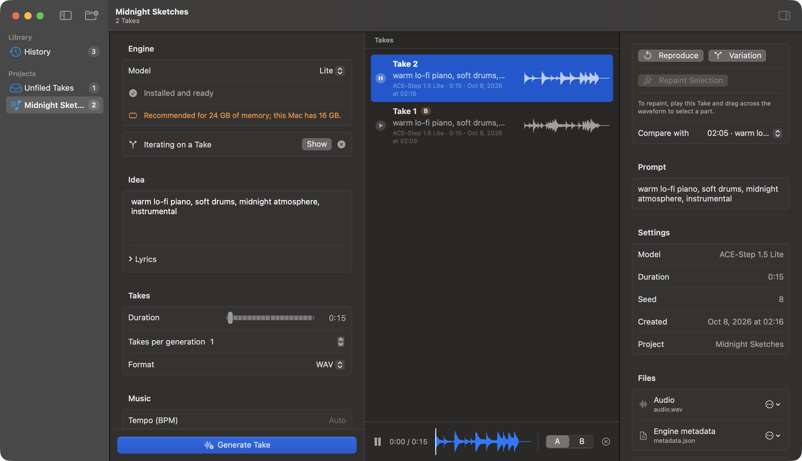
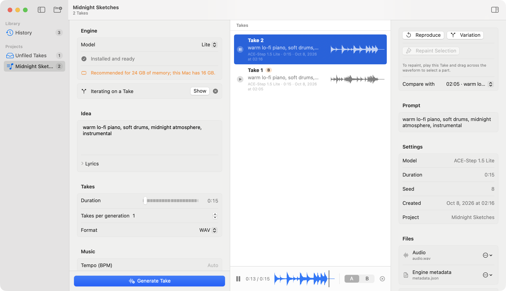
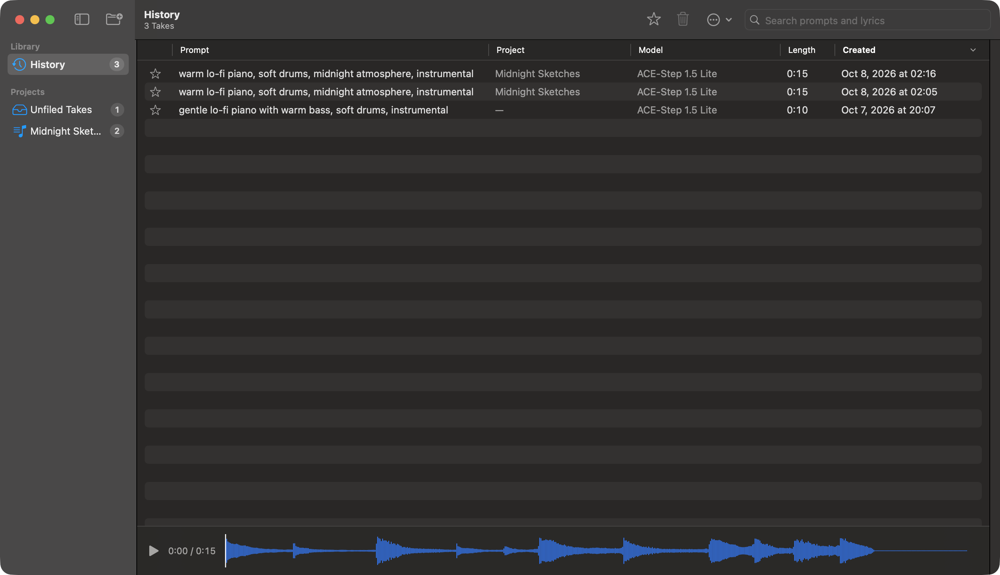
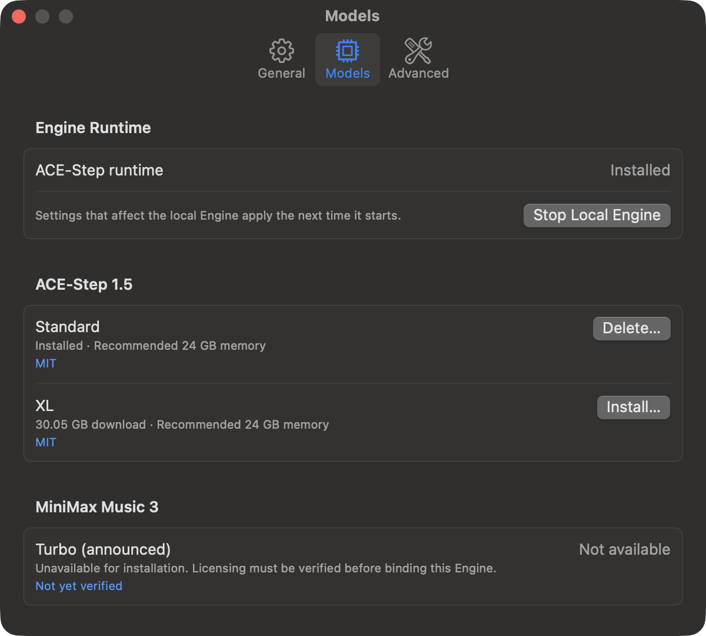
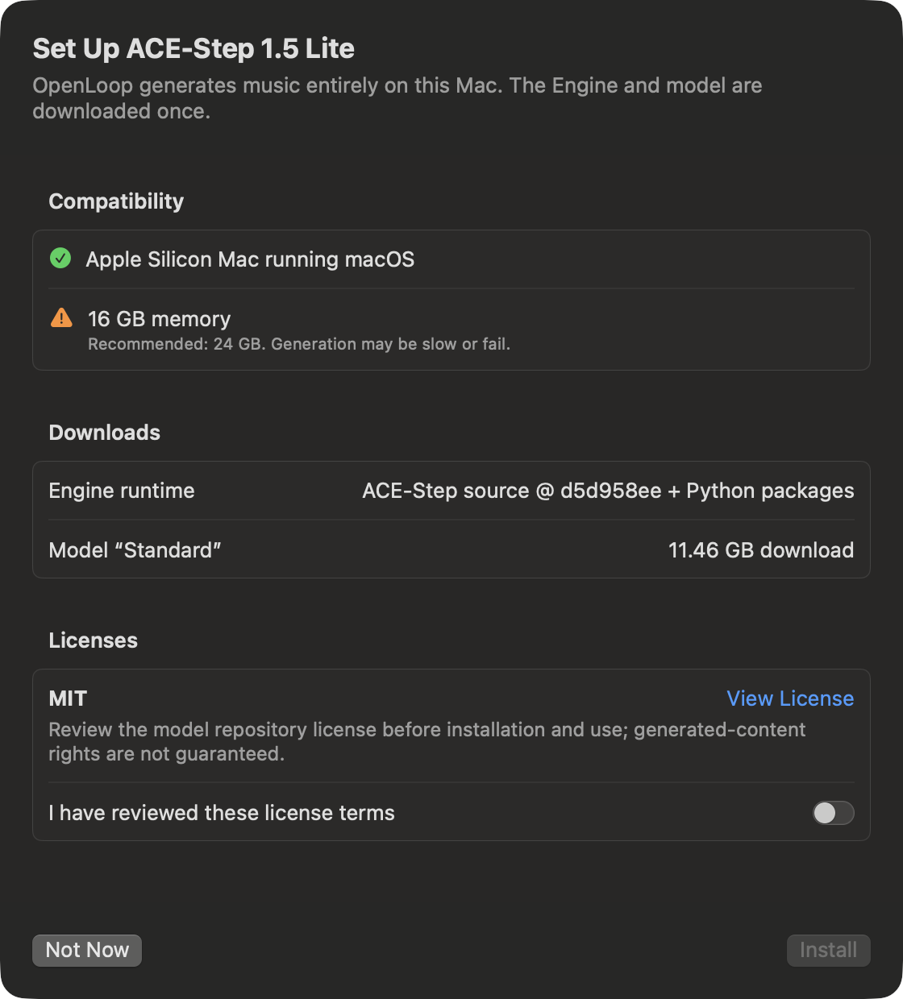

<div align="center">


# OpenLoop

**在 Mac 上本地生成音乐。**

[](https://github.com/thedavidweng/OpenLoop/actions/workflows/ci.yml)
[](https://github.com/thedavidweng/OpenLoop/releases)
[](./LICENSE)


[官网](https://openloop.blahaj.uk) · [下载](https://github.com/thedavidweng/OpenLoop/releases) · [CLI](docs/cli.md) · [English](./README.md)



</div>

OpenLoop 是一款原生 macOS AI 音乐生成应用。它在本机运行
[ACE-Step 1.5](https://github.com/ace-step/ACE-Step-1.5) 等开放模型：无需账号，不上传提示词或音频，生成的文件保存在本机。

> [!NOTE]
> **v0.2.2 Alpha。** 应用使用 ad-hoc 签名，尚未公证。固定版本的 ACE-Step 运行时即使使用 Lite 模型也可能占用超过 16 GB 内存，16 GB 及以下的 Mac 可能频繁换页，建议 24 GB 或以上。

## 功能

- **项目与 Take。** 输入提示词和可选歌词，为每个想法生成一个或多个 Take。
- **对比与迭代。** 用 A/B 播放在两个 Take 之间切换，按种子复现，或生成变体。
- **循环与 Repaint。** 在波形上选取片段循环播放，或只重新生成这一段。
- **历史。** 跨项目搜索和收藏所有生成记录。
- **本地模型管理。** 在设置中安装运行时和模型包，下载大小和许可证一目了然。
- **可脚本化 CLI。** 无界面的 `openloop-cli` 与应用共用资料库，并输出 NDJSON 便于自动化。

<details>
<summary>更多截图</summary>
<br />

| 浅色外观 | 历史 |
| --- | --- |
|  |  |

| 模型 | 首次设置 |
| --- | --- |
|  |  |

</details>

## 安装

1. 从 [Releases](https://github.com/thedavidweng/OpenLoop/releases/tag/v0.2.2-alpha.1) 下载原生 Alpha DMG。
2. 将 OpenLoop 拖入“应用程序”。
3. 打开应用，按首次设置安装引擎和模型。

如果被 Gatekeeper 拦截，请参阅 [docs/release.md](docs/release.md)。从旧版 Tauri 应用升级前请先备份资料库；原生版本只导入一次，且不会移动原始音频。

## 命令行

CLI 随应用一起提供：

```sh
CLI=/Applications/OpenLoop.app/Contents/MacOS/openloop-cli
"$CLI" setup --accept-license
"$CLI" models install ace-step/standard --accept-license
"$CLI" run --configuration ace-step/lite --prompt 'gentle piano' --duration 10
"$CLI" list --json
```

详见 [CLI 指南](docs/cli.md) 和 [NDJSON v2 协议](docs/specs/native-cli.md)。

## 从源码构建

需要 Apple Silicon、macOS 15+、Swift 6.2+ 和 Node.js 24+。

```sh
swift build --package-path native
swift test --package-path native
node scripts/prepare-sidecars.mjs
python3 native/scripts/package-app.py --uv native/binaries/uv-aarch64-apple-darwin
```

应用输出到 `native/dist/OpenLoop.app`。架构说明见 [native/README.md](native/README.md)，打包说明见 [docs/release.md](docs/release.md)。

## 贡献

欢迎提交 issue 和 PR。大型变更请先开 issue 讨论。贡献者需通过 PR 评论签署 [CLA](CLA.md)，详见 [CONTRIBUTING.md](CONTRIBUTING.md)。

## 许可证

OpenLoop 使用 [GNU AGPL-3.0-only](LICENSE) 许可证。此前的 Apache-2.0 授权仍然有效，详见 [LICENSING.md](LICENSING.md)。模型和运行时遵循各自的许可证，生成的音频不保证不受版权主张约束，发布前请查阅模型条款。

## 致谢

基于 [ACE-Step 1.5](https://github.com/ace-step/ACE-Step-1.5) 和 [MLX](https://github.com/ml-explore/mlx) 构建。OpenLoop 与 [OpenKara](https://github.com/thedavidweng/OpenKara) 同属 OpenMusic 系列，由 [David Weng](https://github.com/thedavidweng) 发起。
